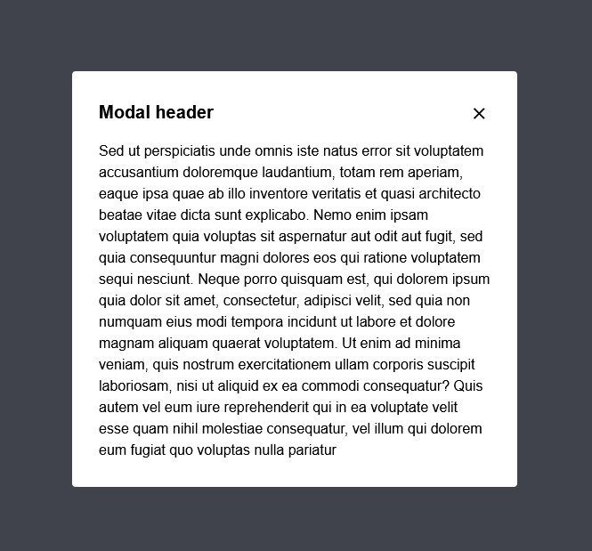

# Modal component plugin for Craft CMS 5.x



## Requirements

This plugin requires Craft CMS 4.0.0r later.

## Installation

To install the plugin, follow these instructions.

1. Open your terminal and go to your Craft project:

        cd /path/to/project

2. Then tell Composer to load the plugin:

        composer require craftsnippets/modal-component

3. In the Control Panel, go to Settings → Plugins and click the “Install” button for Modal component.

## Modal component Overview

The modal component plugin provides you with a very simplistic and robust modal template. It does not make any assumptions about modal content and provides very basic styling which can be easily adjusted to your site template.

Modals created by this plugin integrate seamlessly with Craft templates and provide basic functionality like trapping focus inside modal or proper aria tags for accessibility. Beyond that, you can customize your modal in any way you want.

## How to use

To use modal, you just need to use embed Twig tag with the template provided by plugin:

```



Your modal content - any HTML can go there.



Modal header - optional.



```

You can show or hide the modal in one of the two ways: using the button, or using the JS method. 

To create a button that shows modal, you need to add the `data-a11y-dialog-show` attribute to the button and set it to the ID you set in the `modalId` variable passed to the modal component:

```
<button data-a11y-dialog-show="my-modal-id">open modal</button>
```

To create a button that hides modal, you need to add the `data-a11y-dialog-hide` attribute to the button. If you do not set it to any ID, it will close any modal currently shown.

To use JS function, you need to grab DOM object of modal contaner by using modal ID and use `_dialog.show()` or `_dialog.hide()` method:

```
document.getElementById('my-modal-id')._dialog.show()
document.getElementById('my-modal-id')._dialog.hide()
```

You can also attach behavior to modal `show` and `hide` events:

```
document.getElementById('my-modal-id')._dialog.on('show', function (event) {
  // Do something when modal gets shown
})

document.getElementById('my-modal-id')._dialog.on('hide', function (event) {
  // Do something when modal gets hidden
})
```

## CSS styles

The modal component plugin provides two CSS files - one with very basic functionality responsible for showing and hiding modal and one with the default theme. You can disable either of them by creating a `config/dialog-component.php` file and setting one of these two variables to `false`:

```
public $useBaseCss = false;
public $useDefaultTheme = false;
```

## a11y-dialog library

Modal component uses excellent [a11y-dialog](https://a11y-dialog.netlify.app/) library for its internal functionality. I recommend reading a11y-dialog documentation if you want to learn more and maybe customize your modal behavior further.

## Credits

Brought to you by [Piotr Pogorzelski](http://craftsnippets.com/)

Plugin icon by [Vaadin Icons](https://iconscout.com/free-icon/modal-10).